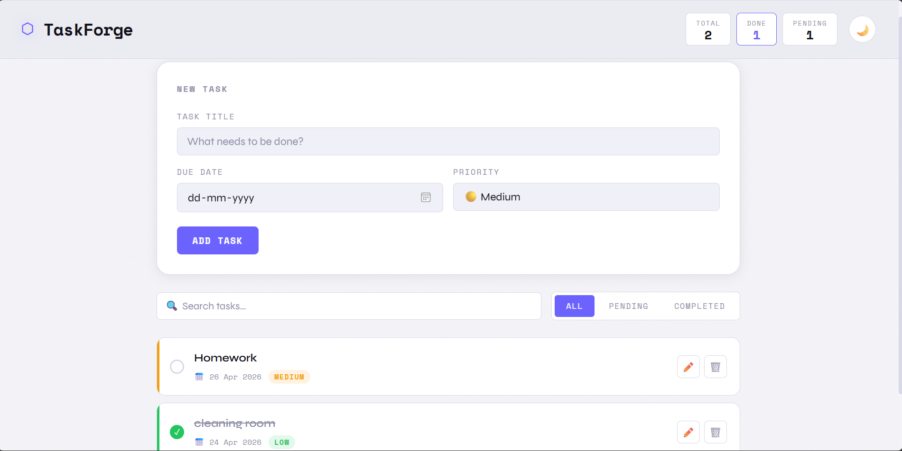
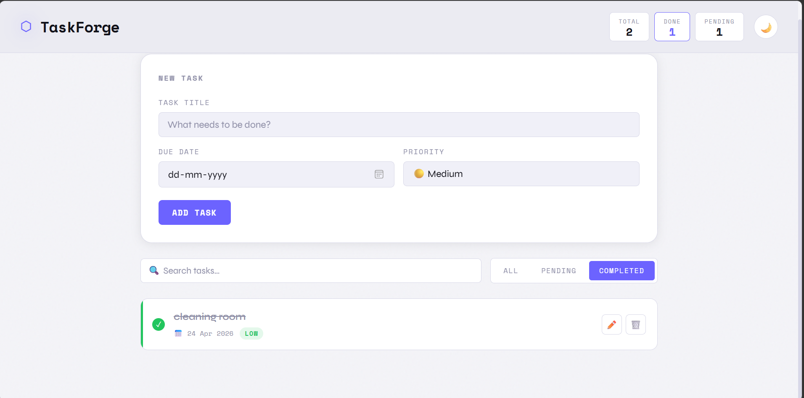
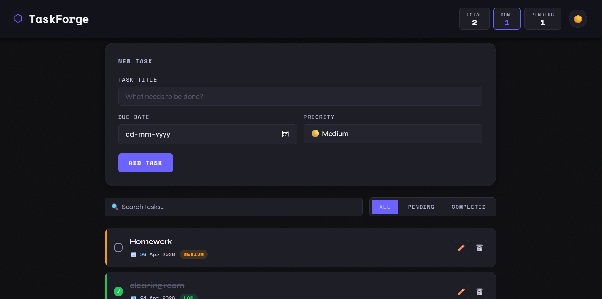
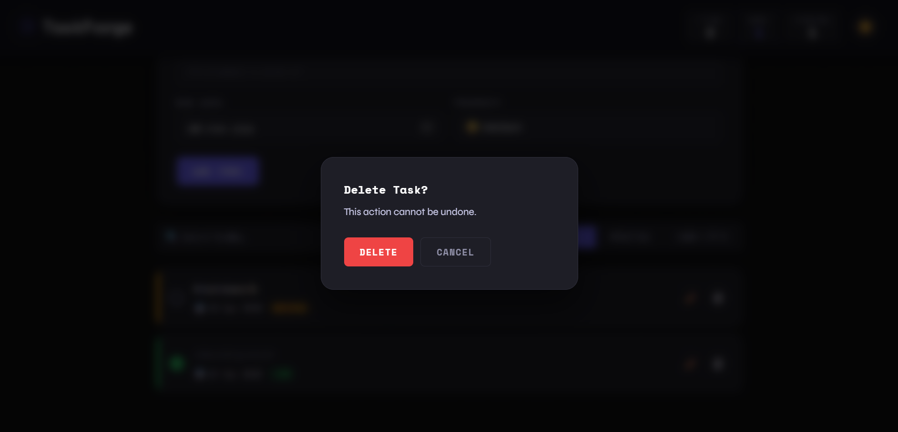
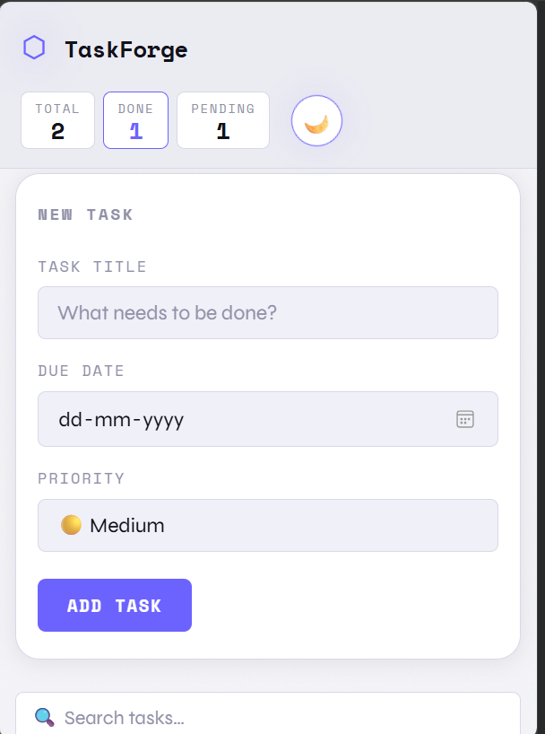

# 🚀 TaskForge — Advanced Task Manager

TaskForge is a modern and responsive task manager web application built using **HTML, CSS, and Vanilla JavaScript**.
It helps users efficiently manage daily tasks with features like filtering, search, priorities, due dates, and dark/light mode.

---

## 🌐 Live Demo

🔗 https://sanduru-akhila-teja.github.io/taskforge-task-manager/

---

## ✨ Features

* ➕ Add new tasks
* ✏️ Edit existing tasks
* 🗑️ Delete tasks with confirmation modal
* ✅ Mark tasks as completed
* 🔍 Search tasks instantly
* 📂 Filter tasks (All / Pending / Completed)
* ⚡ Priority levels (Low / Medium / High)
* 📅 Due date support
* 🌙 Dark / Light mode toggle
* 💾 Local Storage persistence
* 📱 Fully responsive design

---

## 🛠 Technologies Used

* HTML5
* CSS3 (Flexbox & Grid)
* JavaScript (Vanilla JS)
* Local Storage API

---

## 📸 Screenshots

### Main Dashboard

### Completed Task

### Dark Mode

### Delete Confirmation

### Mobile View

---

## ▶ How to Run Locally

1. Download or clone this repository
2. Open `index.html` in any browser
3. Start managing your tasks

---

## 🔮 Future Improvements

* Drag-and-drop task reordering
* Task categories
* Reminder notifications
* Cloud-based storage
* User authentication

---

## 👨‍💻 Author

**Sanduru-Akhila-Teja**

GitHub:
https://github.com/Sanduru-Akhila-Teja

---
